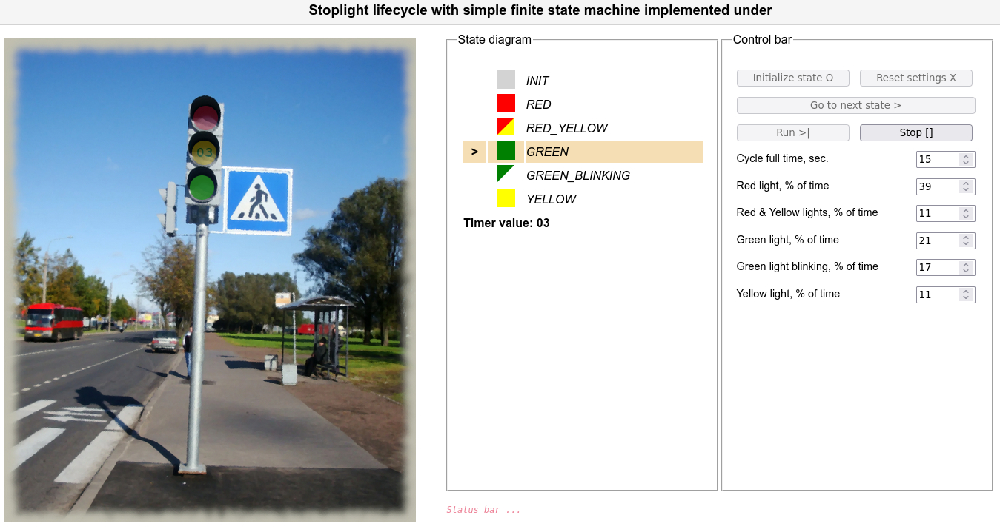

<!DOCTYPE html>
<html lang="en">
	<head>
		<meta charset="utf-8" />
		<base href="https://github.com/merzsh/samples/">
	</head>
	<body>
		<h1>Finite state machine based on stoplight (traffic lights) sample</h1>
		
<b>Welcome!</b> The sample demonstartes working of 'useReducer' Redux-like React built-in hook as finite state machine.
			Program logic is implemented with TypeScript language, UI - with HTML/CSS.
			Building tools are Babel and Webpack.

		<h2>Prerequisites</h2>
		
To run this sample you have to perform several simple steps:

		<ul style="list-style-type:square;">
			<li><b>Node JS</b> - install Node JS software</li>
			<li><b>npm/yarn</b> - install Webpack/NPM/yarn web package managers</li>
			<li><b>Dependencies</b> - install all dependencies counted in file 'package.json' with command
			<i>'npm install'</i>. Dependencies will be installed in 'node_modules' directory.</li>
			<li><b>Launch</b> - open sample directory and type command 'yarn start'.
				Browser (tested in Mozilla Firefox) will show GUI listed below.</li>
		</ul>
		<h2>GUI of launched Stoplight sample</h2>
		
Left panel visualize state machine working. Central panel demonstrates internal states switching.
			Right panel provides options for machine life cycle.
			<b>'Go to next state'</b> button guides to nearest next acceptable state.
			<b>'Run'</b> button runs machine cycle. <b>'Stop'</b> - stops the running machine.

		
		<h3>Copyright<h3>
		
This application is authored by Andrey Miroshnichenko and distributed under GPL-2.0 license
			(merzsh@gmail.com, https://github.com/merzsh).

	</body>
</html>